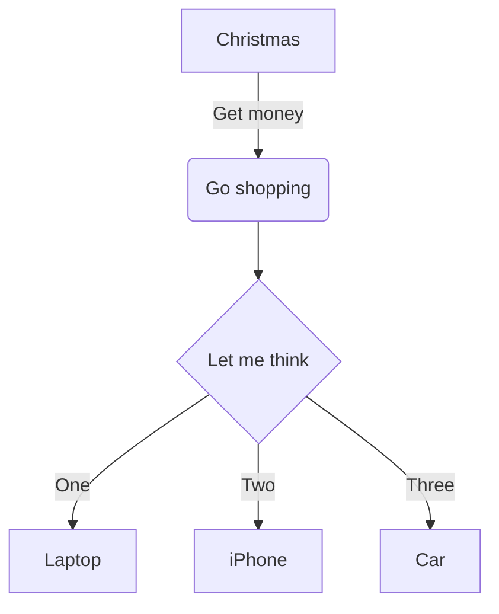
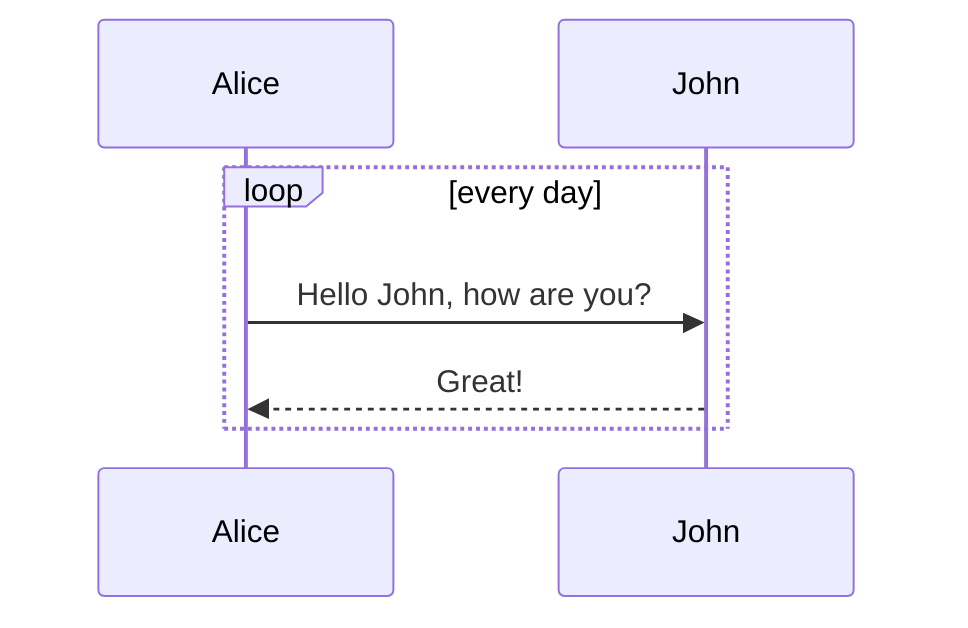
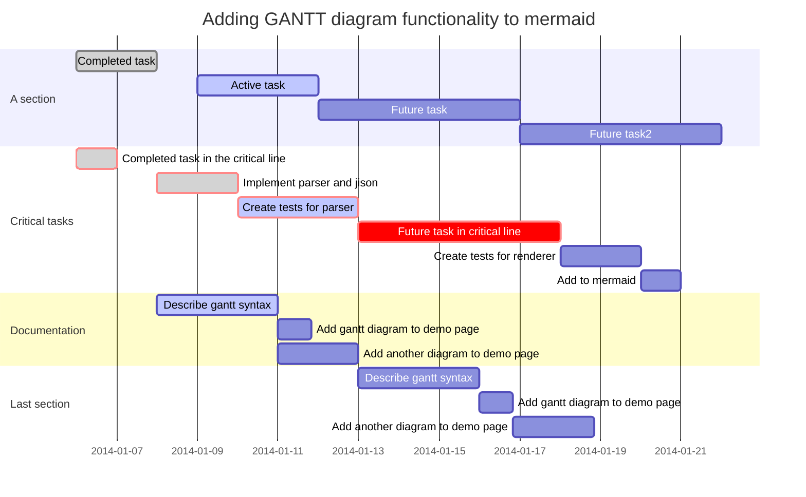

# Markdown-Cheatsheet

Markdown editing help

https://help.github.com/categories/writing-on-github/
https://daringfireball.net/projects/markdown/syntax

Emoji: http://www.webpagefx.com/tools/emoji-cheat-sheet/


# Heading Level 1
```
# Heading Level 1
```

## Heading Level 2
```
## Heading Level 2
```

### Heading Level 3
```
### Heading Level 3
```

#### Heading Level 4
```
#### Heading Level 4
```

##### Heading Level 5
```
##### Heading Level 5
```

###### Heading Level 6
```
###### Heading Level 6
```

**Bold**
```
**This text will be bold**
__This text will be bold__
```

*Italic*
```
*This text will be italic*
_This text will be italic_
```

<u>Underline</u><br>
Подчеркивание не поддерживается в Markdown. Тем не менее, Markdown поддерживает HTML, так что вы можете использовать тэги, чтобы подчеркнуть текст.
```
<u>underline text</u>
```

<del>Strikethrough</del><br>
Зачеркивание не поддерживается в Markdown (если вы не используете его на GitHub, который позволяет использовать текст синтаксис для зачеркивания). Тем не менее, Markdown поддерживает HTML, так что вы можете использовать теги в зачеркиванием.
```
<del>strikethrough text</del>
~~text~~
```

Новый параграф
```
<br>
```

This is a [link to Google](http://google.com).
```
This is a [link to Google](http://google.com).
```

Image:


```


```

Image with a link to **http://twitter.com/chibicode**:

[](http://twitter.com/chibicode)
```

[](http://twitter.com/chibicode)
```

This is a paragraph.

- List Item 1
- List Item 2
- List Item 3


```
- List Item 1
- List Item 2
- List Item 3
```

This is another paragraph.

* List Item 1
* List Item 2
* List Item 3

```
* List Item 1
* List Item 2
* List Item 3
```

Or:

+ List Item 1
+ List Item 2
+ List Item 3

```
+ List Item 1
+ List Item 2
+ List Item 3
```

- List Item 1
    - List Item 1.1
    - List Item 1.2
        - List Item 1.2.1
    - List Item 1.3

```
- List Item 1
    - List Item 1.1
    - List Item 1.2
        - List Item 1.2.1
    - List Item 1.3
```

  - List Item 1

    Second paragraph of list item 1

    Third paragraph of list item 1

- List Item 2

    Second paragraph of list item 2

    Third paragraph of list item 2

```
  - List Item 1

    Second paragraph of list item 1

    Third paragraph of list item 1

- List Item 2

    Second paragraph of list item 2

    Third paragraph of list item 2

```

This is a paragraph.

1. List Item 1
2. List Item 2
3. List Item 3


```
1. List Item 1
2. List Item 2
3. List Item 3
```


This is a paragraph.


1. List Item 1
1. List Item 2
1. List Item 3

```
1. List Item 1
1. List Item 2
1. List Item 3
```

1. List Item
    1. List Item
    2. List Item
        1. List Item
    3. List Item

```
1. List Item
    1. List Item
    2. List Item
        1. List Item
    3. List Item
```

1. List Item 1

    Second paragraph of list item 1

    Third paragraph of list item 1

2. List Item 2

    Second paragraph of list item 2

    Third paragraph of list item 2

```
1. List Item 1

    Second paragraph of list item 1

    Third paragraph of list item 1

2. List Item 2

    Second paragraph of list item 2

    Third paragraph of list item 2
```


- [x] @mentions, #refs, [links](), **formatting**, and <del>tags</del> supported
- [x] list syntax required (any unordered or ordered list supported)
- [x] this is a complete item
- [ ] this is an incomplete item


First Header | Second Header
------------ | -------------
Content from cell 1 | Content from cell 2
Content in the first column | Content in the second column


There are many different ways to style code with GitHub's markdown. If you have inline code blocks, wrap them in backticks: `var example = true`.  If you've got a longer block of code, you can indent with four spaces:

    if (isAwesome){
      return true
    }

GitHub also supports something called code fencing, which allows for multiple lines without indentation:

```
if (isAwesome){
  return true
}
```

And if you'd like to use syntax highlighting, include the language:

```javascript
if (isAwesome){
  return true
}
```

- [x] This is a complete item
- [ ] This is an incomplete item

```
***this is bold and italic***  and ___so is this___
```

`This won't be *italic* or **bold** at all.`

1. this starts a list *with* numbers
+  this will show as number "2"
*  this will show as number "3."
9. any number, +, -, or * will keep the list going.
    * just indent by 4 spaces (or tab) to make a sub-list
        1. keep indenting for more sub lists
    * here i'm back to the second level
    
    Tables
You can create tables using pipes and dashes like this:
  First Header  | Second Header
  ------------- | -------------
  Content Cell  | Content Cell
  Content Cell  | Content Cell


[I'm an inline-style link](https://www.google.com)

[I'm an inline-style link with title](https://www.google.com "Google's Homepage")

[I'm a reference-style link][Arbitrary case-insensitive reference text]

[I'm a relative reference to a repository file](../blob/master/LICENSE)

[You can use numbers for reference-style link definitions][1]

Or leave it empty and use the [link text itself]

Some text to show that the reference links can follow later.

[arbitrary case-insensitive reference text]: https://www.mozilla.org
[1]: http://slashdot.org
[link text itself]: http://www.reddit.com


Images

Here's our logo (hover to see the title text):

Inline-style:


Reference-style:
![alt text][logo]

[logo]: https://github.com/adam-p/markdown-here/raw/master/src/common/images/icon48.png "Logo Title Text 2"
Here's our logo (hover to see the title text):

```javascript
var s = "JavaScript syntax highlighting";
alert(s);
```

```python
s = "Python syntax highlighting"
print s
```

```
No language indicated, so no syntax highlighting.
But let's throw in a <b>tag</b>.
```

Colons can be used to align columns.

| Tables        | Are           | Cool  |
| ------------- |:-------------:| -----:|
| col 3 is      | right-aligned |  |
| col 2 is      | centered      |    |
| zebra stripes | are neat      |     |

The outer pipes (|) are optional, and you don't need to make the raw Markdown line up prettily. You can also use inline Markdown.

Markdown | Less | Pretty
--- | --- | ---
*Still* | `renders` | **nicely**
1 | 2 | 3


Blockquotes

> Blockquotes are very handy in email to emulate reply text.
> This line is part of the same quote.


---

Hyphens

***

Asterisks

___

Underscores


> This is the first level of quoting.
>
> > This is nested blockquote.
>
> Back to the first level.


> ## This is a header.
>
> 1.   This is the first list item.
> 2.   This is the second list item.
>
> Here's some example code:
>
>     return shell_exec("echo $input | $markdown_script");


To make lists look nice, you can wrap items with hanging indents:

*   Lorem ipsum dolor sit amet, consectetuer adipiscing elit.
    Aliquam hendrerit mi posuere lectus. Vestibulum enim wisi,
    viverra nec, fringilla in, laoreet vitae, risus.
*   Donec sit amet nisl. Aliquam semper ipsum sit amet velit.
    Suspendisse id sem consectetuer libero luctus adipiscing.
But if you want to be lazy, you don't have to:

*   Lorem ipsum dolor sit amet, consectetuer adipiscing elit.
Aliquam hendrerit mi posuere lectus. Vestibulum enim wisi,
viverra nec, fringilla in, laoreet vitae, risus.
*   Donec sit amet nisl. Aliquam semper ipsum sit amet velit.
Suspendisse id sem consectetuer libero luctus adipiscing.
If list items are separated by blank lines, Markdown will wrap the items in <p> tags in the HTML output. For example, this input:

*   Bird
*   Magic


1.  This is a list item with two paragraphs. Lorem ipsum dolor
    sit amet, consectetuer adipiscing elit. Aliquam hendrerit
    mi posuere lectus.

    Vestibulum enim wisi, viverra nec, fringilla in, laoreet
    vitae, risus. Donec sit amet nisl. Aliquam semper ipsum
    sit amet velit.

2.  Suspendisse id sem consectetuer libero luctus adipiscing.
It looks nice if you indent every line of the subsequent paragraphs, but here again, Markdown will allow you to be lazy:

*   This is a list item with two paragraphs.

    This is the second paragraph in the list item. You're
only required to indent the first line. Lorem ipsum dolor
sit amet, consectetuer adipiscing elit.

*   Another item in the same list.
To put a blockquote within a list item, the blockquote's > delimiters need to be indented:

*   A list item with a blockquote:

    > This is a blockquote
    > inside a list item.
To put a code block within a list item, the code block needs to be indented twice -- 8 spaces or two tabs:

*   A list item with a code block:


Link to [Google](http://google.com).	Link to Google.
Link to <http://google.com>.	Link to http://google.com.
Link to [Google][] with attributes later in the document.

Another Link to the [search engine][Google].

[Google]: http://google.com "The Google!" style="border: solid black 1px;" target="_blank"
Link to Google with attributes later in the document.


> This is the first level of quoting.

>> This is nested blockquote
that runs onto the next line.

> Back to the first level.


| First Header | Second Header |         Third Header |
| :----------- | :-----------: | -------------------: |
| First row    |      Data     | Very long data entry |
| Second row   |    **Cell**   |               *Cell* |


| First Header  | Second Header | Third Header         |
| :------------ | :-----------: | -------------------: |
| First row     | Data          | Very long data entry |
| Second row    | **Cell**      | *Cell*               |
| Third row     | Cell that spans across two columns  ||
[Table caption, works as a reference][section-mmd-tables-table1] 


| Header One | Header Two | Header Three | Header Four |
| ---------- | :--------- | :----------: | ----------: |
| Default    | Left       | Center       | Right       |

| Column 1 | Column 2 | Column 3 | Column 4 |
| -------- | :------: | -------- | -------- |
| No span  | Span across three columns    |||


++insert++

## ==mark==

ubscript: H~2~O

You can also use inline math: `$H_2O$`


## Superscript: 29^th^

You can also use inline math: `$29^{th}$`

`print 'hello code'`

    evens = [1, 2, 3, 4, 5].collect do |item|
      item * 2
    end

```javascript
$(document).ready(function() {
  $('pre code').each(function(i, block) {
    hljs.highlightBlock(block);
  });
});
```

First Header | Second Header
------------ | -------------
Content from cell 1 | Content from cell 2
Content in the first column | Content in the second column

| Left-Aligned  | Center Aligned  | Right Aligned |
| :------------ |:---------------:| -----:|
| col 3 is      | some wordy text | $1600 |
| col 2 is      | centered        |   $12 |

Task list

- [ ] a bigger project
  - [x] first subtask
  - [x] follow up subtask
  - [ ] final subtask
- [ ] a separate task

Abbreviation

Markup is based on [php markdown extra](https://michelf.ca/projects/php-markdown/extra/#abbr) definition, but without multiline support:

*[HTML]: Hyper Text Markup Language
*[W3C]:  World Wide Web Consortium
The HTML specification
is maintained by the W3C.

 Footnote

Here is a footnote reference,[^1] and another.[^longnote]

[^1]: Here is the footnote.

[^longnote]: Here's one with multiple blocks.

    Subsequent paragraphs are indented to show that they
belong to the previous footnote.


Here is an inline note.^[Inlines notes are easier to write, since
you don't have to pick an identifier and move down to type the
note.]

[Footnote Syntax](http://pandoc.org/README.html#footnotes)

Mathematical formula `$y = x^2$`

Inline math: `$\dfrac{ \tfrac{1}{2}[1-(\tfrac{1}{2})^n] }{ 1-\tfrac{1}{2} } = s_n$`.

Math block:

```katex
\oint_C x^3\, dx + 4y^2\, dy

2 = \left(
 \frac{\left(3-x\right) \times 2}{3-x}
 \right)

\sum_{m=1}^\infty\sum_{n=1}^\infty\frac{m^2\,n}
 {3^m\left(m\,3^n+n\,3^m\right)}

\phi_n(\kappa) =
 \frac{1}{4\pi^2\kappa^2} \int_0^\infty
 \frac{\sin(\kappa R)}{\kappa R}
 \frac{\partial}{\partial R}
 \left[R^2\frac{\partial D_n(R)}{\partial R}\right]\,dR
```

[Mathematical Formula Syntax](http://meta.wikimedia.org/wiki/Help:Displaying_a_formula)

AsciiMath

Inline AsciiMath: `@(1/2[1-(1/2)^n])/(1-(1/2))=s_n@`

```AsciiMath
oint_Cx^3 dx+4y^2 dy

2=(((3-x)xx2)/(3-x))

sum_(m=1)^oosum_(n=1)^oo(m^2 n)/(3^m(m3^n+n3^m)
```

```ASCIIMath
phi_n(kappa) = 1/(4pi^2 kappa^2)
 int_0^oo (sin(kappa R))/(kappa R)
 del/(del R)
[R^2 (del D_n (R))/(del R)] del R
```

[AsciiMath Documentation](http://asciimath.org/)


Flowchart



[Flowchart Syntax](http://knsv.github.io/mermaid/#flowcharts-basic-syntax)

::: warning
Adding many flowcharts will slow down the editor.
:::


## Sequence diagram



[Sequence Diagram Syntax](http://knsv.github.io/mermaid/#sequence-diagrams)

::: warning
Adding many sequence diagrams will slow down the editor.
:::


## Gantt diagram



[Gantt Diagram Syntax](http://knsv.github.io/mermaid/#gant-diagrams)

::: warning
Adding many gantt diagrams will slow down the editor.
:::


## Custom Container

Markup is similar to fenced code blocks. Valid container types are `success`, `info`, `warning` and `danger`.

::: info
You have new mail.
:::

::: danger
Staying up all night is bad for health.
:::


## Definition list

Term 1
  ~ Definition 1

Term 2
  ~ Definition 2a
  ~ Definition 2b

[Definition List Syntax](http://pandoc.org/README.html#definition-lists)


## HTML

If you find the markdown syntax too limited, you can try some <span style="color: blue;">HTML<span>:

<p style="text-align:center;"></p>

<a href="https://github.com/tylingsoft/markdown-plus" target="_blank"></a>


## Charts

[Documentation for charts](http://www.chartjs.org/docs/)

### Line Chart

```chart
{
  "type": "line",
  "data": {
    "labels": [
      "January",
      "February",
      "March",
      "April",
      "May",
      "June",
      "July"
    ],
    "datasets": [
      {
        "label": "# of bugs",
        "fill": false,
        "lineTension": 0.1,
        "backgroundColor": "rgba(75,192,192,0.4)",
        "borderColor": "rgba(75,192,192,1)",
        "borderCapStyle": "butt",
        "borderDash": [],
        "borderDashOffset": 0,
        "borderJoinStyle": "miter",
        "pointBorderColor": "rgba(75,192,192,1)",
        "pointBackgroundColor": "#fff",
        "pointBorderWidth": 1,
        "pointHoverRadius": 5,
        "pointHoverBackgroundColor": "rgba(75,192,192,1)",
        "pointHoverBorderColor": "rgba(220,220,220,1)",
        "pointHoverBorderWidth": 2,
        "pointRadius": 1,
        "pointHitRadius": 10,
        "data": [
          65,
          59,
          80,
          81,
          56,
          55,
          40
        ],
        "spanGaps": false
      }
    ]
  },
  "options": {}
}
```

<br/>

[Documentation for Line Chart](http://www.chartjs.org/docs/#line-chart)

### Bar Chart

```chart
{
  "type": "bar",
  "data": {
  "labels": [
    "Red",
    "Blue",
    "Yellow",
    "Green",
    "Purple",
    "Orange"
  ],
  "datasets": [
    {
    "label": "# of Votes",
    "data": [
      12,
      19,
      3,
      5,
      2,
      3
    ],
    "backgroundColor": [
      "rgba(255, 99, 132, 0.2)",
      "rgba(54, 162, 235, 0.2)",
      "rgba(255, 206, 86, 0.2)",
      "rgba(75, 192, 192, 0.2)",
      "rgba(153, 102, 255, 0.2)",
      "rgba(255, 159, 64, 0.2)"
    ],
    "borderColor": [
      "rgba(255,99,132,1)",
      "rgba(54, 162, 235, 1)",
      "rgba(255, 206, 86, 1)",
      "rgba(75, 192, 192, 1)",
      "rgba(153, 102, 255, 1)",
      "rgba(255, 159, 64, 1)"
    ],
    "borderWidth": 1
    }
  ]
  },
  "options": {}
}
```

<br/>

[Documentation for Bar Chart](http://www.chartjs.org/docs/#bar-chart)

### Radar Chart

```chart
{
  "type": "radar",
  "data": {
    "labels": [
      "Eating",
      "Drinking",
      "Sleeping",
      "Designing",
      "Coding",
      "Cycling",
      "Running"
    ],
    "datasets": [
      {
        "label": "My First dataset",
        "backgroundColor": "rgba(179,181,198,0.2)",
        "borderColor": "rgba(179,181,198,1)",
        "pointBackgroundColor": "rgba(179,181,198,1)",
        "pointBorderColor": "#fff",
        "pointHoverBackgroundColor": "#fff",
        "pointHoverBorderColor": "rgba(179,181,198,1)",
        "data": [
          65,
          59,
          90,
          81,
          56,
          55,
          40
        ]
      },
      {
        "label": "My Second dataset",
        "backgroundColor": "rgba(255,99,132,0.2)",
        "borderColor": "rgba(255,99,132,1)",
        "pointBackgroundColor": "rgba(255,99,132,1)",
        "pointBorderColor": "#fff",
        "pointHoverBackgroundColor": "#fff",
        "pointHoverBorderColor": "rgba(255,99,132,1)",
        "data": [
          28,
          48,
          40,
          19,
          96,
          27,
          100
        ]
      }
    ]
  },
  "options": {}
}
```

<br/>

[Documentation for Radar Chart](http://www.chartjs.org/docs/#radar-chart)

### Polar Area Chart

```chart
{
  "type": "polarArea",
  "data": {
    "datasets": [
      {
        "data": [
          11,
          16,
          7,
          3,
          14
        ],
        "backgroundColor": [
          "#FF6384",
          "#4BC0C0",
          "#FFCE56",
          "#E7E9ED",
          "#36A2EB"
        ],
        "label": "My dataset"
      }
    ],
    "labels": [
      "Red",
      "Green",
      "Yellow",
      "Grey",
      "Blue"
    ]
  },
  "options": {}
}
```

<br/>

[Documentation for Polar Area Chart](http://www.chartjs.org/docs/#polar-area-chart)

### Pie Chart

```chart
{
  "type": "pie",
  "data": {
    "labels": [
      "Red",
      "Blue",
      "Yellow"
    ],
    "datasets": [
      {
        "data": [
          300,
          50,
          100
        ],
        "backgroundColor": [
          "#FF6384",
          "#36A2EB",
          "#FFCE56"
        ],
        "hoverBackgroundColor": [
          "#FF6384",
          "#36A2EB",
          "#FFCE56"
        ]
      }
    ]
  },
  "options": {}
}
```

<br/>

[Documentation for Pie Chart](http://www.chartjs.org/docs/#doughnut-pie-chart)

### Doughnut Chart

```chart
{
  "type": "doughnut",
  "data": {
    "labels": [
      "Red",
      "Blue",
      "Yellow"
    ],
    "datasets": [
      {
        "data": [
          300,
          50,
          100
        ],
        "backgroundColor": [
          "#FF6384",
          "#36A2EB",
          "#FFCE56"
        ],
        "hoverBackgroundColor": [
          "#FF6384",
          "#36A2EB",
          "#FFCE56"
        ]
      }
    ]
  },
  "options": {}
}
```

<br/>

[Documentation for Doughnut Chart](http://www.chartjs.org/docs/#doughnut-pie-chart)

### Bubble Chart

```chart
{
  "type": "bubble",
  "data": {
    "datasets": [
      {
        "label": "First Dataset",
        "data": [
          {
            "x": 20,
            "y": 30,
            "r": 15
          },
          {
            "x": 40,
            "y": 10,
            "r": 10
          }
        ],
        "backgroundColor": "#FF6384",
        "hoverBackgroundColor": "#FF6384"
      }
    ]
  },
  "options": {}
}
```

<br/>

[Documentation for Bubble Chart](http://www.chartjs.org/docs/#bubble-chart)
